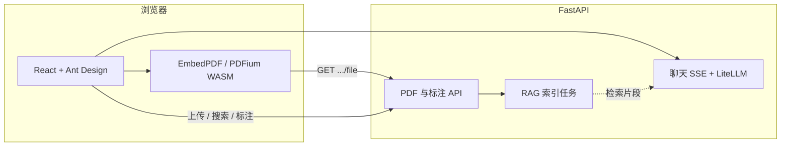

# PDF 阅读助手

在浏览器中上传 PDF，结合文档内容与划选片段向大模型提问；支持流式回答、推理过程分区展示。后端 **FastAPI**，前端 **React + Vite**；模型经 **LiteLLM** 统一调用，可对接 OpenAI 兼容接口、通义、DeepSeek、Ollama 等。

---

## 功能概览

- **阅读**：基于 **PDFium（WebAssembly）** 的 PDF 渲染；缩放、翻页、目录侧栏；文本划选；文档内搜索（后端 PyMuPDF 文本匹配）；标注与导出（标注 JSON 经 API 持久化）
- **对话**：划选文字一键带入上下文；**SSE** 流式输出；若模型返回推理字段，思考过程与正文分区展示，结束后思考区默认收起
- **RAG（可选）**：上传后后台构建 **FAISS + sentence-transformers** 向量索引；对话按语义检索相关片段；回答可点 **来源** 跳转页码并高亮。索引未就绪时回退为按页全文摘录
- **会话**：当前打开的文档信息保存在 **sessionStorage**（刷新同源会话内可恢复）

---

## 技术路线

从「数据怎么流、谁负责什么」的角度，当前实现可以概括为下面几条链路。

### 整体架构

- **前后端分离**：生产可分开部署；开发模式下 **Vite** 将浏览器的 **`/api/*`** 代理到 **`http://127.0.0.1:8000`**，避免跨域与硬编码后端地址（可选环境变量 **`VITE_API_BASE`** 用于无代理场景）。
- **API 形态**：PDF 与标注等为 REST；聊天为 **SSE**（`POST /api/chat/stream`）。

### PDF 与阅读器

1. **上传**：前端 `multipart` → FastAPI 将原始字节写入 **`backend/uploads/`**，用 **PyMuPDF** 解析元数据、页数、目录等并返回 `doc_id`。
2. **阅读**：前端用 **主线程 `fetch`** 拉取 **`/api/pdf/{doc_id}/file`**（绕过不当缓存与代理边界问题），将 **`ArrayBuffer`** 交给 **EmbedPDF** → **PDFium WASM**（Worker）渲染；插件负责视口、滚动、渲染、搜索高亮、选区、标注、缩放、撤销栈等。
3. **辅助接口**：全文/单页文本、文档内搜索坐标、RAG 就绪状态、标注读写等由 **`/api/pdf/...`** 各子路由提供。

### RAG 与对话上下文

1. **建索引**（可关）：上传成功后后台任务对 PDF 按页抽文本、分块，**sentence-transformers** 嵌入，**faiss-cpu** 落盘在 **`backend/data/`**（与 `doc_id` 对应）。通过 **`.env`** 中 **`RAG_*` / `RAG_ENABLED`** 控制模型与开关。
2. **对话**：用户消息 + 当前文档 id（及可选划选页码/文本）→ 后端按配置组装上下文：**优先向量检索片段**，否则按页拼接全文（受 **`PDF_CONTEXT_MAX_CHARS`** 等限制）→ **LiteLLM** 调用具体模型 → 流式 JSON/SSE 回前端展示。

### 技术路线简图



---

## 技术栈

| 层级 | 主要技术 |
|------|----------|
| 前端 | React 18、TypeScript、Vite 6、Zustand、Ant Design、**EmbedPDF**（**PDFium** WASM）、KaTeX、react-markdown |
| 后端 | Python 3.10+、FastAPI、Uvicorn、Pydantic、PyMuPDF、LiteLLM、python-dotenv |
| 检索 / 嵌入（RAG） | faiss-cpu、sentence-transformers、PyTorch、NumPy |

---

## 环境要求

- **Python** 3.10+（建议）
- **Node.js** 18+、**npm** 8+（与 `package-lock.json` v3 一致；更低版本往往仍可安装，但可能告警）

---

## 快速开始

### 首次部署 / 换电脑

1. 安装 Python、Node.js；Windows 安装 Python 时勾选 **Add to PATH**。
2. **Windows**：双击 **`setup-once.bat`**（安装 `backend/requirements.txt` 与 `frontend` 的 `npm install`，首次含 PyTorch 等可能较久）。
3. **macOS / Linux / WSL**：`chmod +x scripts/setup-once.sh && ./scripts/setup-once.sh`
4. 复制 **`.env.example` → `.env`**，至少配置 **`LLM_API_KEY`**（使用对话功能时）；详见 **`.env.example`** 内说明（含 **`LLM_MODEL`**、**`LLM_API_BASE`**、**`RAG_*`** 等）。
5. 启动：Windows 用 **`start.bat`**，或按下一节手动起两个终端。

**可选自检（Windows）**：

```powershell
powershell -ExecutionPolicy Bypass -File scripts\check-dev-env.ps1
```

### 环境变量要点

- **`LLM_API_KEY`**、**`LLM_MODEL`**：必填/常用；第三方网关需配 **`LLM_API_BASE`**。
- **`PDF_CONTEXT_MAX_CHARS`**（默认约 24000）：单次注入 PDF 正文字数上限，越小通常越快、越省 token。
- **`RAG_ENABLED=false`**：可跳过向量索引与部分重依赖，仅全文摘录模式；需要语义检索时再打开并保证依赖装全。

### 手动启动（两终端）

```bash
# 终端一：后端
cd backend
pip install -r requirements.txt   # 若已 setup-once 可跳过
python -m uvicorn main:app --reload --host 127.0.0.1 --port 8000
```

```bash
# 终端二：前端
cd frontend
npm install   # 若已 setup-once 可跳过
npm run dev
```

浏览器打开 **http://localhost:5173**。

### Windows 一键脚本

- **`start.bat`**：检查 **`frontend/node_modules`** 与 **`uvicorn`** → **`kill-dev-ports.bat`** 释放 **8000 / 5173 / 5174** → 新开窗口启动后端与 **`npm run dev`** → 尝试打开浏览器。若无 **`.env`** 会从 **`.env.example`** 复制一份。
- **`stop.bat`** 或单独运行 **`kill-dev-ports.bat`**：仅释放端口。

若 Vite 报 **`ECONNREFUSED 127.0.0.1:8000`**，说明后端未监听 8000，请查看 **`PDF-Agent-Backend`** 窗口日志；**http://127.0.0.1:8000/api/health** 应返回 `{"status":"ok"}`。

---

## 前端直连后端（可选）

默认依赖 Vite 代理。若前端静态资源与 API 不同源、且无反向代理，可设置 **`VITE_API_BASE`**（如 `http://127.0.0.1:8000`），见 **`frontend/src/services/api.ts`**。

---

## 目录与数据

| 路径 | 说明 |
|------|------|
| **`backend/uploads/`** | 上传的 PDF 与标注 JSON 等 |
| **`backend/data/`** | RAG 索引与元数据（按文档 id） |
| **`.env`** | 密钥与配置，已在 **`.gitignore`**，勿提交 |

---

## 常见问题

| 现象 | 处理 |
|------|------|
| `'vite' 不是内部或外部命令` / 缺少 `node_modules` | 在 **`frontend`** 执行 **`npm install`**，或运行 **`setup-once.bat`** |
| `No module named uvicorn` | 对 **`start.bat` 使用的同一个 `python`** 执行 **`pip install -r backend/requirements.txt`**；多 Python 时用 **`where python`** 核对 |
| **`ECONNREFUSED 127.0.0.1:8000`** | 确认后端已启动且无报错 |
| PDF 渲染失败、曾提示响应体过短 | 已处理缓存与拉取逻辑；**重启后端**并 **Ctrl+F5**；仍异常则浏览器直连 **`http://127.0.0.1:8000/api/pdf/<doc_id>/file`** 看是否完整下载 |
| 改代码不生效 / 端口占用 | **`kill-dev-ports.bat`** 或用 **`start.bat`** |
| 页面像旧缓存 | **Ctrl + F5** |
| 回答慢 / 费 token | 换更快模型，或调低 **`PDF_CONTEXT_MAX_CHARS`** |
| **`pip install` 慢、torch 过大** | 可暂设 **`RAG_ENABLED=false`**；需要 RAG 再完整安装 |

---

## 脚本一览（根目录）

| 文件 | 作用 |
|------|------|
| **`setup-once.bat`** | 一键安装 Python 与前端依赖（Windows） |
| **`start.bat`** | 检查环境后启动前后端（Windows） |
| **`stop.bat` / `kill-dev-ports.bat`** | 释放开发常用端口 |
| **`scripts/setup-once.sh`** | 同上（Unix 系） |
| **`scripts/check-dev-env.ps1`** | 环境自检（Windows PowerShell） |
